<p align="center">
  
</p>

<h1 align="center">NurApp</h1>

<p align="center">
  Aplikasi Android untuk jadwal sholat, notifikasi adzan tepat waktu, membaca Al-Qur'an 30 juz, dan penunjuk arah kiblat secara offline. Dibuat dengan Kotlin dan Jetpack Compose.
</p>

<p align="center">
  <a href="https://github.com/Nur-App-Muslim/Nur-App/releases/download/v1.0.0/NurApp-v1.0.0.apk">
    
  </a>
</p>

---

## 📥 Unduh & Pasang Aplikasi

1. Unduh berkas resmi: **[NurApp-v1.0.0.apk](https://github.com/Nur-App-Muslim/Nur-App/releases/download/v1.0.0/NurApp-v1.0.0.apk)** *(~36 MB)*.
2. Buka berkas APK di ponsel Android Anda untuk menginstal.
3. Buka NurApp dan ikuti panduan awal untuk mengaktifkan izin lokasi dan jadwal notifikasi adzan tepat waktu.

---

## Tangkapan Layar

### Fitur Utama
<p align="center">
  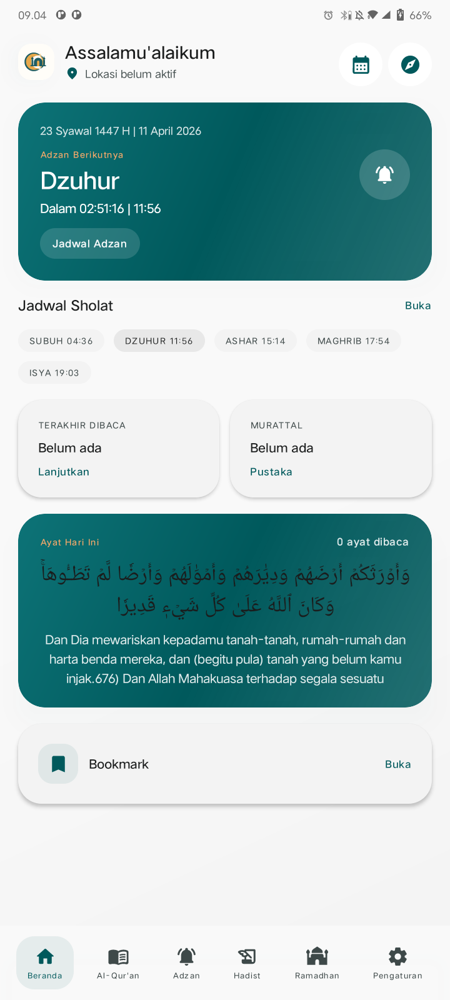
  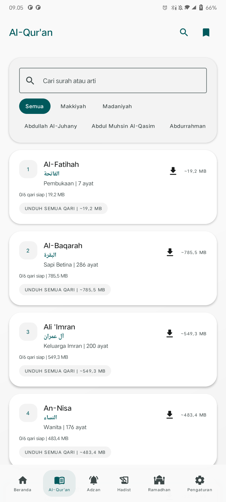
  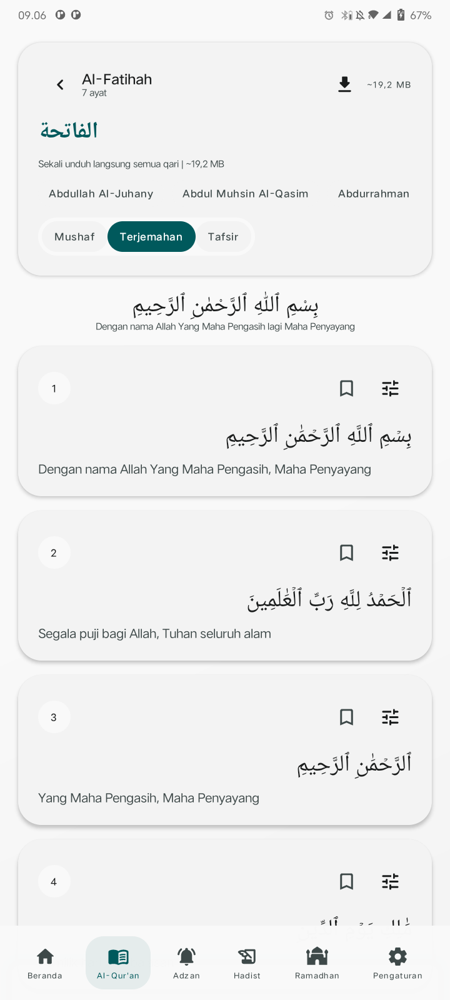
  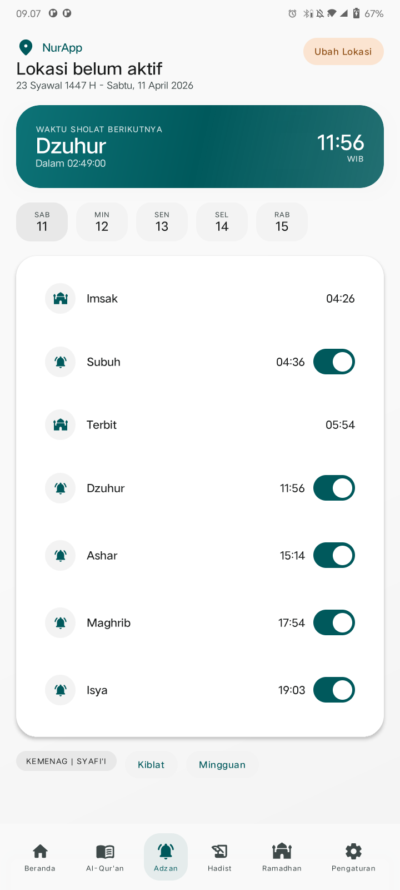
</p>

### Fitur Penunjang
<p align="center">
  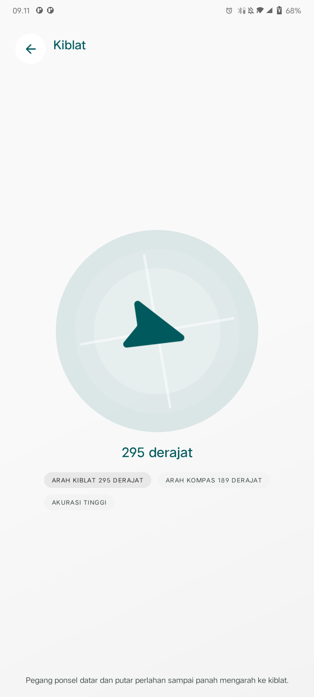
  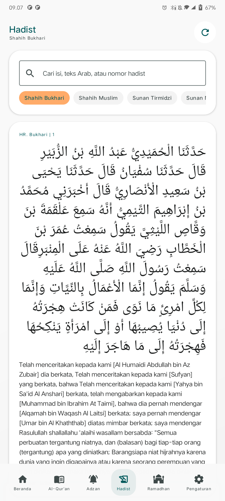
  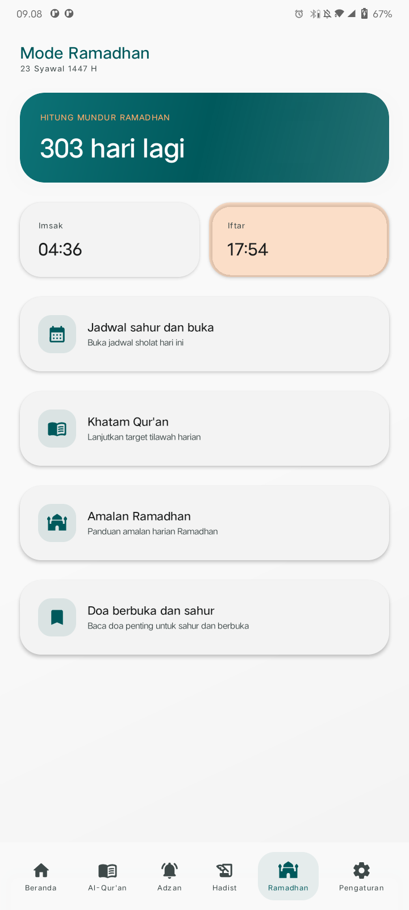
  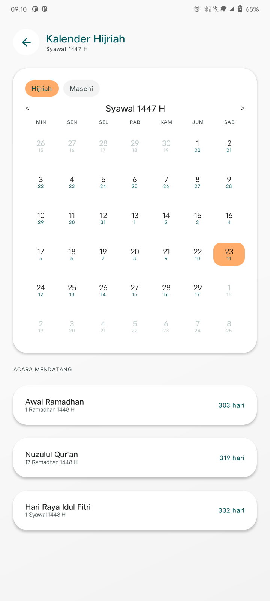
</p>

### Alur Awal & Pengaturan
<p align="center">
  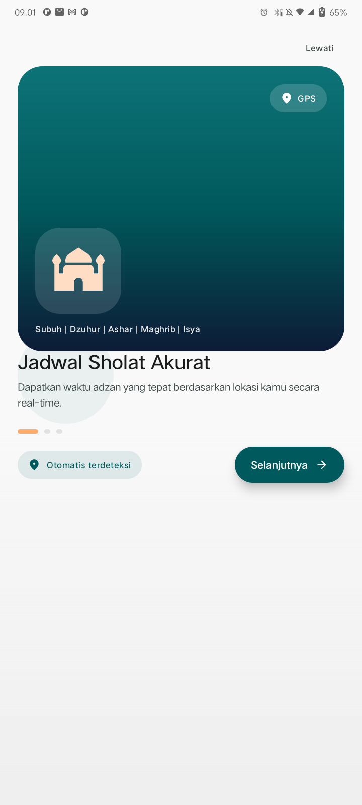
  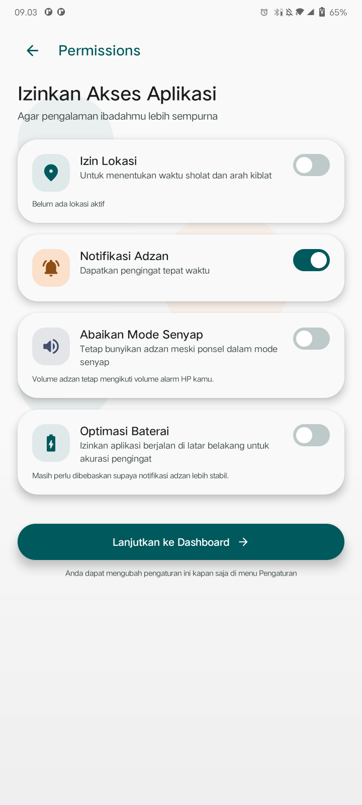
  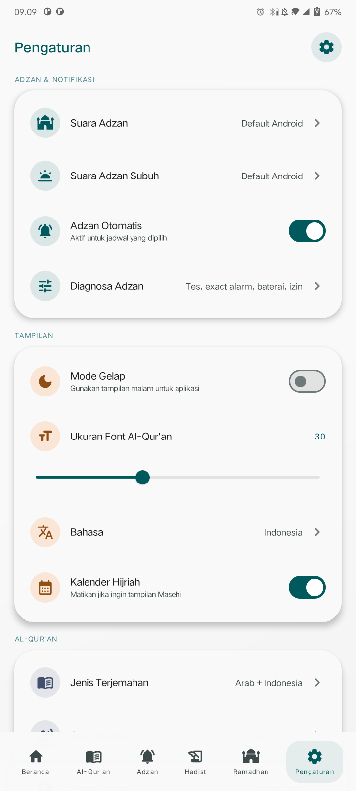
</p>

---

## Fitur

- **Jadwal Sholat & Adzan**: Perhitungan waktu sholat offline berbasis koordinat GPS, lengkap dengan alarm adzan tepat waktu dan opsi dering saat mode senyap.
- **Al-Qur'an Offline**: Teks Arab, transliterasi Latin, terjemahan bahasa Indonesia dan Inggris, penanda bacaan terakhir (*last read*), serta bookmark ayat.
- **Audio Murattal**: Pilihan audio per surah dari qari pilihan yang bisa diunduh untuk didengarkan offline.
- **Arah Kiblat**: Kompas penunjuk arah Ka'bah menggunakan sensor perangkat.
- **Hadits & Doa**: Kumpulan hadits harian, doa-doa hisnul muslim, dan jadwal imsakiyah Ramadhan.
- **Tema & Tampilan**: Mendukung mode terang dan gelap (*dark mode*), serta pengaturan ukuran font Arab.

---

## Cara Build

### Kebutuhan:
- Android Studio (versi Ladybug / Iguana atau yang lebih baru)
- JDK 17
- Android SDK Platform 34+

### Langkah Kompilasi:

1. Clone repositori ini:
   ```bash
   git clone https://github.com/Nur-App-Muslim/Nur-App.git
   cd Nur-App
   ```

2. Buka proyek di Android Studio, atau build langsung melalui terminal:
   ```bash
   # Linux / macOS
   ./gradlew assembleDebug

   # Windows PowerShell
   .\gradlew.bat assembleDebug
   ```

Berkas APK hasil build akan berada di `app/build/outputs/apk/debug/app-debug.apk`.

---

## Izin Aplikasi

- `ACCESS_FINE_LOCATION` / `ACCESS_COARSE_LOCATION`: Menghitung jadwal sholat dan arah kiblat sesuai lokasi pengguna.
- `POST_NOTIFICATIONS`: Menampilkan notifikasi waktu sholat (Android 13+).
- `SCHEDULE_EXACT_ALARM` / `USE_EXACT_ALARM`: Memastikan alarm adzan berbunyi tepat waktu.
- `RECEIVE_BOOT_COMPLETED`: Menjadwalkan ulang alarm sholat secara otomatis setelah perangkat dinyalakan ulang.

---

## Lisensi

Proyek ini menggunakan lisensi [MIT License](LICENSE).
